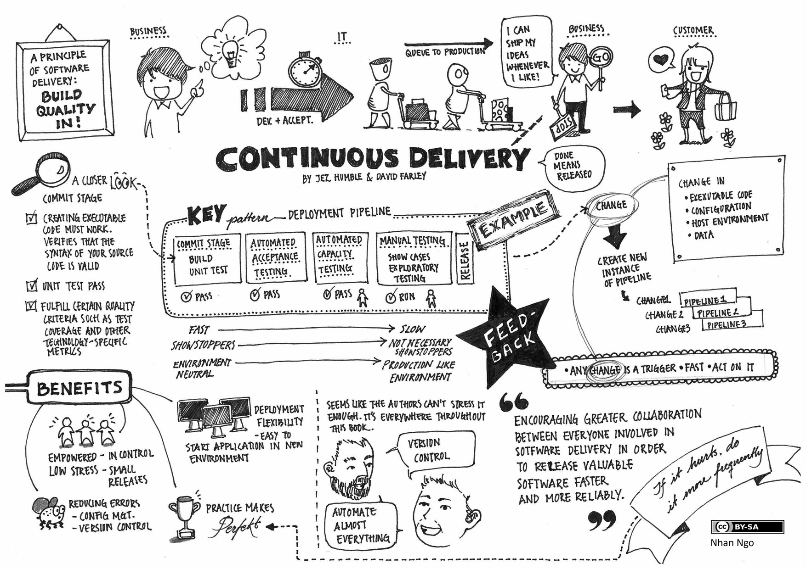

!SLIDE inverse center transition=fade

<h2 style="color:white;">Processos de Delivery</h2>

!SLIDE incremental transition=fade

# Processos de Delivery

**Como funciona um processo de delivery Tradicional?**

.callout.info `Este exemplo baseia-se nas principais práticas como CAB, análise de riscos e compliance, implantação de sistemas etc...`

!SLIDE incremental transition=fade

**Continuos Integration**

Prática adotada por times no processo de desenvolvimento de software onde um repositório é utilizado para centralizar o armazenamento de código, é a partir deste repositório que testes e integrações são executadas e que os binários e código fonte são obtidos.

- Um dos objetivos por trás da integração é centralizar dados de forma que possamos encontrar e investigar falhas rapidamente o que se enquadra na filosofia **"Fail Fast, Fail Often"**;

- O objetivo é melhorar a qualidade de software e reduzir o tempo que leva para validar e lançar novas atualizações;

.callout.info `Segundo HUMBLE e FARLEY o termo foi descrito pela primeira vez no livro de Kent Beck "Extreme Programming Explained", a proposta é que se a integração regular de seu código é boa, por que não fazê-la o tempo todo?`

!SLIDE incremental transition=fade

# Processos de Delivery

**O que é preciso para chegar ao "Continuous Integration" ?**

- 1. Versionamento de Código;
- 2. Processo de Build Automatizado;
- 3. Prévio acordo entre os times envolvidos;

**Ferramentas de Apoio:** Algumas das ferramentas mais famosas criadas com essa finalidade estão listadas neste chart criado pela CNCF:

- [https://landscape.cncf.io/category=continuous-integration-delivery&format=card-mode&grouping=category](https://landscape.cncf.io/category=continuous-integration-delivery&format=card-mode&grouping=category);

!SLIDE incremental transition=fade

# Processos de Delivery

**Continuous Delivery**

A Entrega contínua é outra prática relacionada a desenvolvimento de software onde alterações de código são criadas, testadas e preparadas automaticamente para liberação para produção;

- Esta prática pode ser entendida como o próximo passo após a intregação contínu;

- O conceito é que uma vez que a integração e teste automatizado de código seja implementada é possível gerar de forma automática a versão ou artefato pronto para entrada em produção.

!SLIDE incremental transition=fade

!SLIDE incremental transition=fade

# Processos de Delivery

**Continuous Deployment**

- Além das terminologias referentes a integração e entrega contínua representandas pelos acronimos ci/cd existe um terceiro elemento chamado Deployment Contínuo;

- A diferença entre delivery e deploy é sútil e se dá apenas no processo de entrega em produção: No modelo conhecido como "Contínuos Delivery"  existe um processo manual de aprovação, já no Contínuos Deployment **a aprovação é automática**;

- Este é o estágio final de um modelo 100% ágil de entrega de código em produção e consequentemente o mais díficil de ser alcançado.

!SLIDE incremental transition=fade

# Processos de Delivery

**Continuous Delivery vs. Continuous Deployment**

A amazon possui algumas publicações muito bem resumidas sobre cada uma dessas etapas, entre essas publicações o gráfico usado para descrever a relação entre os três processos/práticas de delivery é uma ótima base para entendimento:

